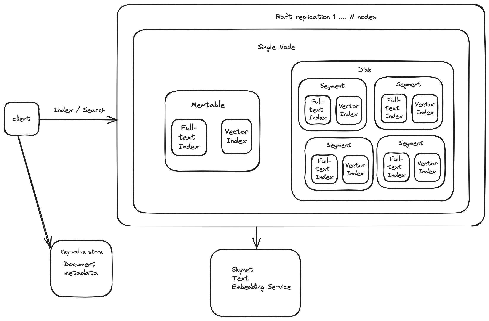

xdb: Distributed lite vector database built from *scratch.

#### What it does:
- full-text search using proximity ranking
- semantic search via HNSW + Cosine distance
- integrated basic text embedding service  (Python http API around a sentence transformer)
- (naive) weighted full-text + semantic search hybrid
- in-memory serving + disk persistence
- fault-tolerance with segment replication using Raft
- buggy, very buggy

#### What it's not:
- production-ready (code is pretty sus right now)
- perfect (because enemy of good)

#### Architecture


#### Getting started
Install the dependencies for the basic text embedding service in `third_party` folder using pip.
```bash
pip install -r requirements.txt
```
Then start the service like so:
```bash
uvicorn main:app
```

Set an environment variable `EmbeddingHost` which points to the address of the embedding service
```
export EmbeddingHost="http://127.0.0.1:8000/embeddings"
```

Proceed to start instance(s) of the vector db
##### Run single-node
```bash
go run cmd/server/main.go -httpAddr 127.0.0.1:8111 -nodeId 0 -raftAddr 127.0.0.1:9000
```

#### API

##### GET /search
do a search
```bash
curl --location --request GET '127.0.0.1:8111/search' \
--header 'Content-Type: application/json' \
--data '{"query": "some text"}'
```

##### POST /index
index a document
```bash
curl --location '127.0.0.1:8111/index' --header 'Content-Type: application/json' --data '{"text": "some text"}'
```

##### Run 3-node cluster
Run the commands below on different machines (at least different instances of the project to simulate)
```bash
go run cmd/server/main.go -httpAddr 127.0.0.1:8111 -nodeId 0 -raftAddr 127.0.0.1:9000
```
Replicas join the primary on `127.0.0.1:9000`
```bash
go run cmd/server/main.go -httpAddr 127.0.0.1:8112 -nodeId 1 -raftAddr 127.0.0.1:9001 -joinAddr 127.0.0.1:8111
```

```bash
go run cmd/server/main.go -httpAddr 127.0.0.1:8113 -nodeId 2 -raftAddr 127.0.0.1:9002 -joinAddr 127.0.0.1:8111
```

#### TODO
- Indexing
    - Concurrent indexing using goroutines to process terms
- Retrieval
    - Boolean queries
    - Concurrent memtable search
- Ranking
- API
    - Bulk index
    - Document deletion
- Storage
    - Segment compaction
- Replication
    - Snapshot working?
- Code quality
    - Penance for all the atrocities I committed.


#### *Would not have been possible without these resources:
- [Let's build a Full-Text Search engine](https://artem.krylysov.com/blog/2020/07/28/lets-build-a-full-text-search-engine/)
- [Exploring Memtables](https://www.cloudcentric.dev/exploring-memtables/)
- [hraftd](https://github.com/otoolep/hraftd)
- [Hierarchical Navigable Small Worlds](https://zilliz.com/learn/hierarchical-navigable-small-worlds-HNSW)
- [Information Retrieval
Implementing and Evaluating Search Engines](https://mitpress.mit.edu/9780262528870/information-retrieval/)
- [Distributed Services with Go](https://pragprog.com/titles/tjgo/distributed-services-with-go/)